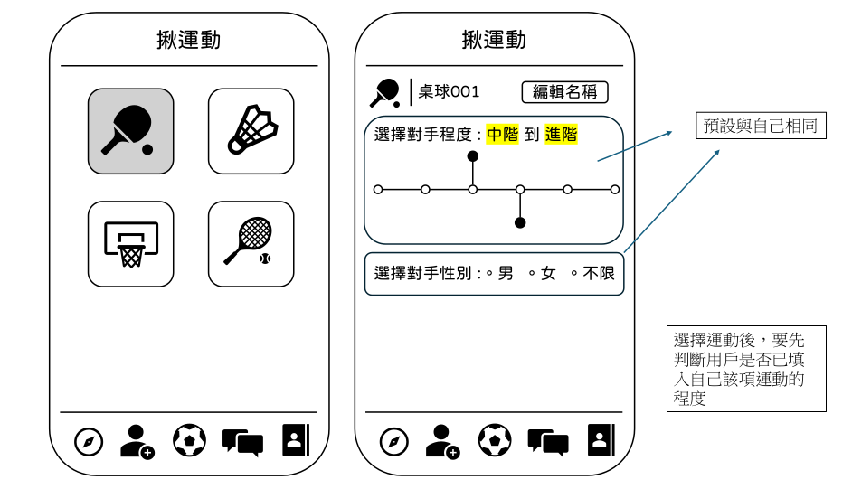

# Sportify

## Table of Content

- [About](#about)
- [Contribute](#contribute)
- [Demo](#demo)
- [Technologies](#technologies)
- [Setup](#setup)
- [Status](#status)
- [Credits](#credits)
- [License](#license)

## About

Sportify 是一款專為運動愛好者設計的社交平台，讓你輕鬆找到運動夥伴、組織運動活動，並參與各種運動挑戰。透過 Sportify，你可以建立個人運動檔案，尋找附近的運動活動，或發起自己的運動邀約，讓運動變得更有趣、更有動力。不論是想嘗試新的運動夥伴，還是尋找程度相符的對手切磋較量，Sportify 都能幫助你建立聯繫，享受運動的樂趣。

Sportify is a social platform designed for sports enthusiasts, making it easy to find workout partners, organize sports activities, and take on exciting challenges. With Sportify, you can create a personal sports profile, browse nearby events, or host your own activities to make exercising more fun and engaging. Whether you want to try new workout partners or find opponents at your skill level for a competitive challenge, Sportify helps you connect and enjoy the world of sports.

## Contribute

- Read [The Ultimate Github Collaboration Guide](https://medium.com/@jonathanmines/the-ultimate-github-collaboration-guide-df816e98fb67) first

- Follow [Conventional Commits](https://www.conventionalcommits.org/en/v1.0.0/)

## Demo

## Technologies

- Frontend: [Next.js](https://nextjs.org/)
- Backend: [Supabase](https://supabase.com/)

## Setup

## Status

Developing "揪運動".

## Credits

## License
